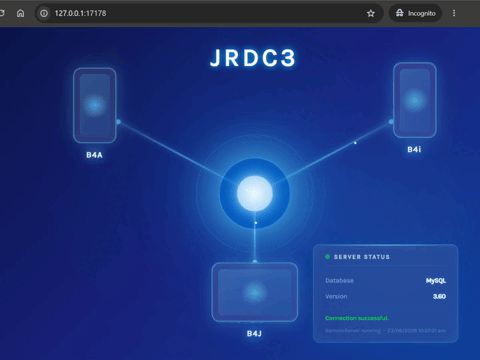

# jRDC3 Server Template

A **B4J** template for creating a **jRDC3** remote database server — an HTTP-based middleware that bridges B4X client applications (B4A, B4i, B4J) with your database, exposing SQL operations through a simple binary-serialized protocol.


---

## Features

- **Multi-database support** — SQLite, MySQL, MariaDB, MSSQL, PostgreSQL, Firebird, DBF
- **Zero-config SQLite** — works out of the box with a bundled sample database
- **HTTP API** — clients send `DBCommand` objects over HTTP and receive `DBResult` responses
- **Batch transactions** — execute multiple INSERT/UPDATE/DELETE statements atomically
- **SSL/TLS** — optional HTTPS with configurable keystore
- **Auto-provisioning** — creates tables and seed data on first run
- **Health check** — `/test` endpoint verifies database connectivity
- **Status dashboard** — browser-based UI at `/` with HTMX-powered auto-refresh
- **Debug mode** — hot-reload SQL queries from config file on each request
- **6 build configurations** — one-click select the database driver in the IDE

---

## Supported Databases

| Database    | JDBC Driver                        |
|-------------|------------------------------------|
| SQLite      | `sqlite-jdbc-min-3.49.1.0`        |
| MySQL       | `mysql-connector-j-9.3.0`         |
| MariaDB     | `mariadb-java-client-3.5.6`       |
| MSSQL       | `jtds-1.3.1` / `mssql-jdbc-12.2.1` |
| PostgreSQL  | `postgresql-42.6.0`                |
| Firebird    | `jaybird-5.0.0.java11`            |
| DBF         | `javadbf-1.13.2` + `dbschema-dbf-jdbc` + H2 |

---

## Prerequisites

- **B4J** IDE (Anywhere Software)
- Java 11+ (JRE or JDK)

---

## Getting Started

### Using the template (end-user)

1. **Copy or install** the `.b4xtemplate` file from `release/` into your B4J `Additional Libraries` folder.
2. In B4J, create a new project using the **jRDC3 Server** template.
3. Select your database **Build Configuration** (SQLite is the default).
4. Open `Files/config.properties` and set your database connection details.
5. Press **F5** (Run).
6. Visit `http://127.0.0.1:17178/` to see the status dashboard.

### Building the template (from source) using #Macros

1. Clone `jRDC3.b4j` to `$APPNAME$.b4j`.
2. Open `$APPNAME$.b4j` in a new B4J windows and remove #Macros Step 1 to Step 5.
3. Package the template to release/jRDC3 Server (3.60).b4xtemplate.
4. Copy the `.b4xtemplate` file to B4J's `Additional Libraries` directory.
5. Check the created template in target directory.
---

## Configuration

All settings are in `Files/config.properties`:

| Section       | Key                   | Default               |
|---------------|-----------------------|-----------------------|
| Server        | `ServerPort`          | `17178`               |
| Server        | `SSLPort`             | `0` (disabled)        |
| Server        | `DebugQueries`        | `True`                |
| SQLite        | `SQLite.DBFile`       | `sample.db`           |
| MySQL         | `MySQL.JdbcUrl`       | `jdbc:mysql://localhost:3306/{DBName}` |
| MSSQL         | `MSSQL.JdbcUrl`       | `jdbc:sqlserver://localhost:1433;databaseName={DBName}` |
| PostgreSQL    | `Postgresql.JdbcUrl`  | `jdbc:postgresql://localhost:5432/{DBName}` |
| Firebird      | `Firebird.JdbcUrl`    | `jdbc:firebirdsql://localhost:3050/{DBName}` |
| DBF           | `DBF.DBFDir`          | (directory of .dbf files) |
| SQL Queries   | (per-database)        | Predefined CRUD for `tbl_category` & `tbl_products` |

To enable SSL, set `SSLPort`, `SSL_KEYSTORE_FILE`, and `SSL_KEYSTORE_PASSWORD`.

---

## API Endpoints

| Endpoint | Method | Description |
|----------|--------|-------------|
| `/`      | GET    | Status dashboard (HTML) |
| `/test`  | GET    | Health check — returns DB connection status as HTML |
| `/rdc`   | POST   | Execute a `DBCommand` (query or batch) — returns `DBResult` |

### `/rdc` Protocol

The `/rdc` endpoint accepts POST requests with a binary-serialized `DBCommand` payload:

- `method=query2` — Execute a SELECT query, returns rows via `B4XSerializator`
- `method=batch2` — Execute multiple DML statements in a single transaction

Both client and server share the `DBCommand` / `DBResult` type definitions.

---

## Architecture

```
┌──────────────┐      HTTP (B4XSerializator)       ┌──────────────────┐
│  B4A / B4i   │  ──────────────────────────────>  │  jRDC3 Server    │
│  / B4J App   │  <──────────────────────────────  │  (B4J / Java)    │
└──────────────┘                                   └────────┬─────────┘
                                                            │ JDBC
                                                            ▼
                                                   ┌──────────────────┐
                                                   │   Database       │
                                                   │  (SQLite/MySQL/  │
                                                   │   MSSQL/etc.)    │
                                                   └──────────────────┘
```

The server uses **B4XSerializator** for binary serialization, **jserver** for HTTP handling, and **jsql** for database access.

---

## Modules

| Module           | Responsibility |
|------------------|----------------|
| `IndexHandler.bas` | Serves the dashboard homepage (`/`) and health check (`/test`) |
| `RDCHandler.bas`   | Processes `/rdc` requests — query and batch execution |
| `RDCConnector.bas` | Database connection management and SQL query loading |
| `HttpsFilter.bas`  | Optional HTTP-to-HTTPS redirect filter |

---

## License

[CC0 1.0 Universal (Public Domain)](LICENSE)

---

*Built with [B4J](https://www.b4x.com/b4j.html) — Rapid Java development by Anywhere Software.*
